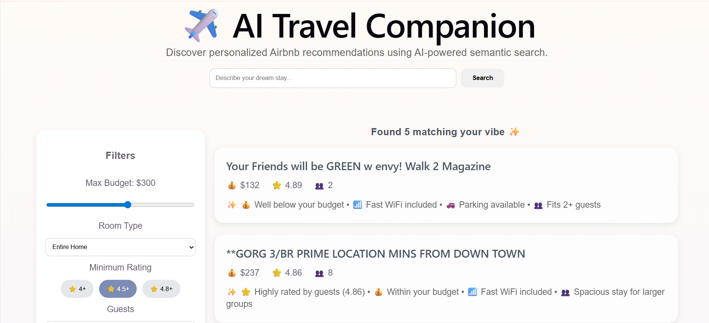
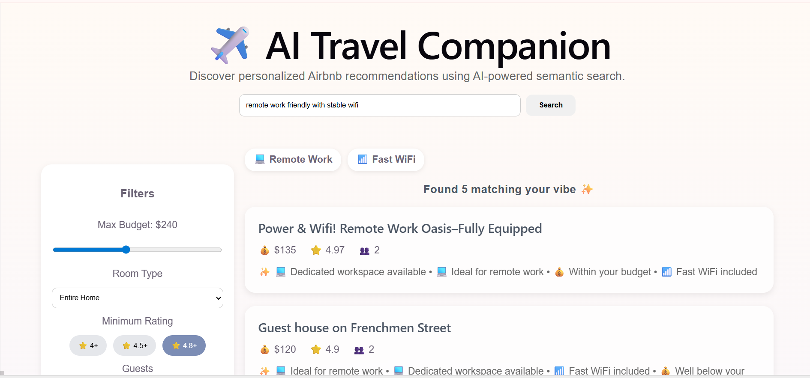
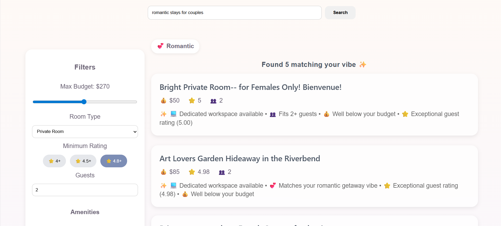
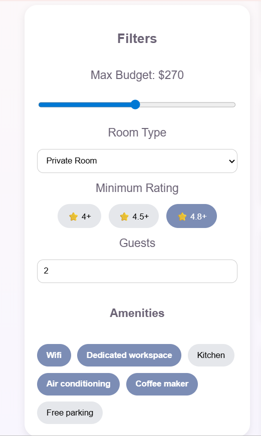
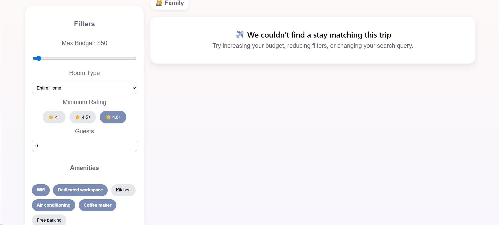

# ✈️ AI Travel Companion

AI Travel Companion is an intelligent Airbnb recommendation system that uses Semantic Search and Natural Language Processing to suggest personalized stays based on a user's travel preferences.

Instead of searching through hundreds of listings, users can simply describe their ideal stay in natural language, such as:

* "Romantic stay near nightlife"
* "Remote work friendly apartment with fast WiFi"
* "Family-friendly home with parking"

The system understands the intent behind the query and recommends the most relevant Airbnb listings.

---

## 🚀 Features

### Semantic Search

Users can describe their ideal stay using natural language instead of exact keywords.

### AI Features

- Semantic search using Sentence Transformers
- Natural language queries
- Embedding-based recommendation engine
- Cosine similarity ranking
- Hybrid filtering using price, rating, guests and amenities

### Smart Filtering

Users can refine results using:

* Maximum Budget
* Room Type
* Guest Capacity
* Minimum Rating
* Amenities

### Recommendation Explanations

Each recommendation includes personalized explanations such as:

* Dedicated workspace available
* Fast WiFi included
* Ideal for remote work
* Close to nightlife hotspots
* Highly rated by guests

### Property Details Modal

Clicking on a property reveals:

* Property Information
* Guest Capacity
* Bedrooms and Beds
* Availability Information
* Host Details
* Booking Information

### Dynamic Query Badges

The interface automatically identifies travel themes such as:

* 💻 Remote Work
* 🎵 Nightlife
* 💕 Romantic
* 👨‍👩‍👧 Family Friendly

---

## 🛠 Tech Stack

### Frontend

* React
* Axios
* CSS

### Backend

* FastAPI
* Pandas
* NumPy
* Scikit-Learn

### AI / NLP

* Sentence Transformers
* all-MiniLM-L6-v2
* Cosine Similarity

---

## Architecture

```text
User Query
      │
      ▼
Sentence Transformer
      │
      ▼
Semantic Embeddings
      │
      ▼
Cosine Similarity Search
      │
      ▼
Apply Filters
(Budget, Rating, Guests, Amenities)
      │
      ▼
Top Airbnb Recommendations
      │
      ▼
React Frontend Display
```

---

## 📂 Project Structure

airbnb-recommendation-system/

├── app/

│ ├── main.py

│ └── recommender.py

├── frontend/

│ └── React Application

├── models/

│ ├── embeddings.npy

│ └── airbnb_data.pkl

├── data/

│ ├── new_orleans_airbnb_listings.csv

├── requirements.txt

└── README.md

---

## Live Backend API

Swagger Documentation:
https://ai-travel-companion-production-61d7.up.railway.app/docs

---

## ⚙️ Installation

Clone the repository:

git clone https://github.com/Anisha3056/AI-Travel-Companion

Navigate to project:

cd airbnb-recommendation-system

Install dependencies:

pip install -r requirements.txt

Run backend:

uvicorn app.main:app --reload

Backend available at:

http://127.0.0.1:8000/docs

Run frontend:

npm install

npm run dev

Frontend available at:

http://localhost:5173

---

## API Endpoints

### Get Recommendations

POST /recommend

Request:

{
"query": "remote work friendly stay",
"max_price": 200,
"room_type": "Private room",
"min_rating": 4.5,
"accommodates": 2,
"amenities": ["Wifi","Free parking"],
"top_n": 5
}

---

### Get Property Details

GET /property/{property_id}

Returns complete information about a selected Airbnb property.

---

### Pictures of working website

## Home page


## Semantic search results



## Filters


## Property Details modal


## No results card


---


## Future Improvements

* Live Airbnb API Integration
* Property Images
* Interactive Maps
* User Accounts
* Saved Favorites
* Personalized Recommendation History

---

## NOTE 
The original reviews dataset is excluded from the repository
because it exceeds GitHub's file size limit.
Preprocessed embeddings and model artifacts are included
so the application can run without the raw reviews file.

## Author

Built with ❤️ by Anisha.
